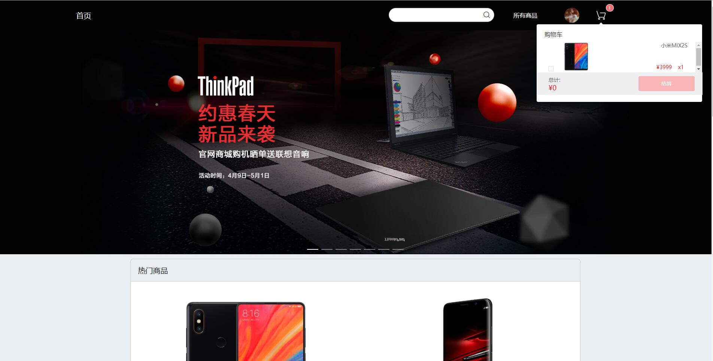
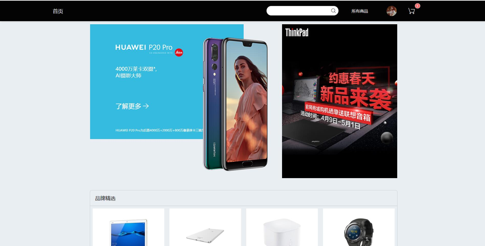
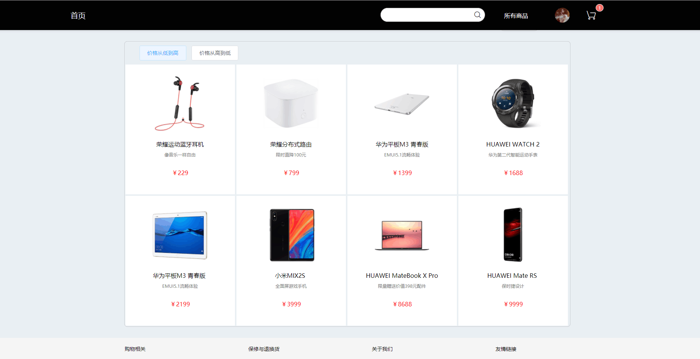
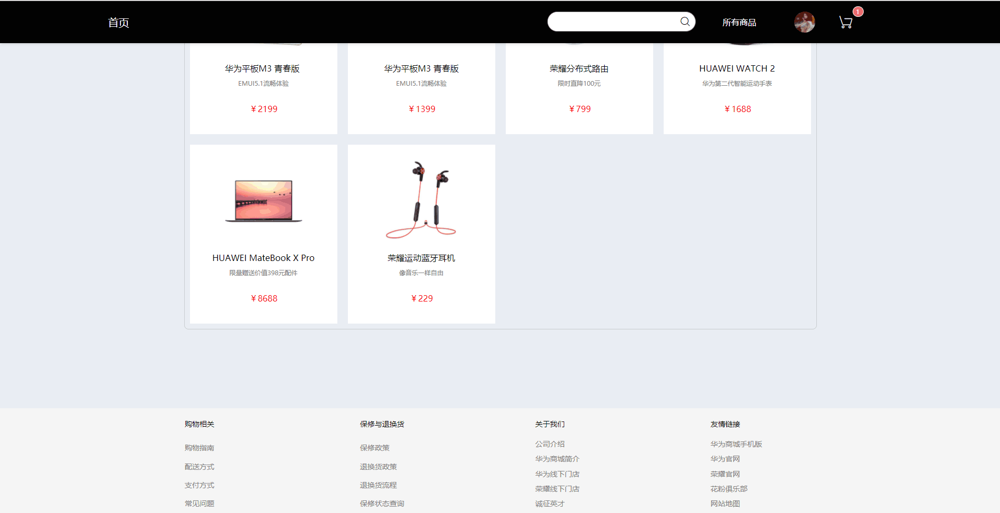
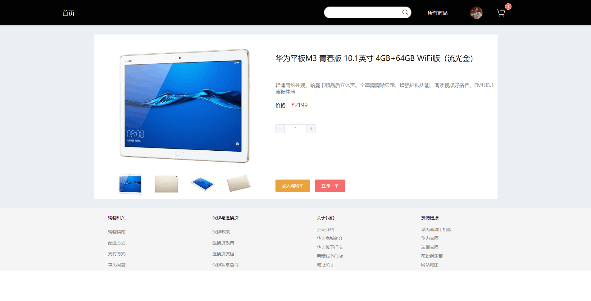
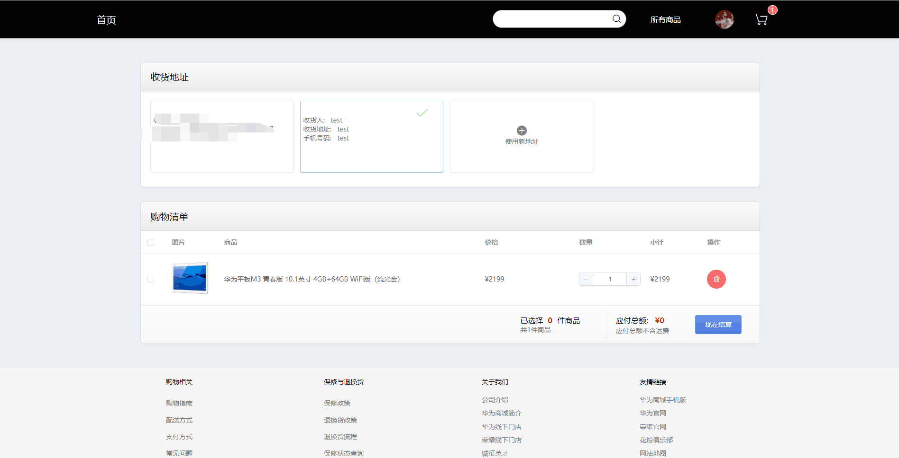
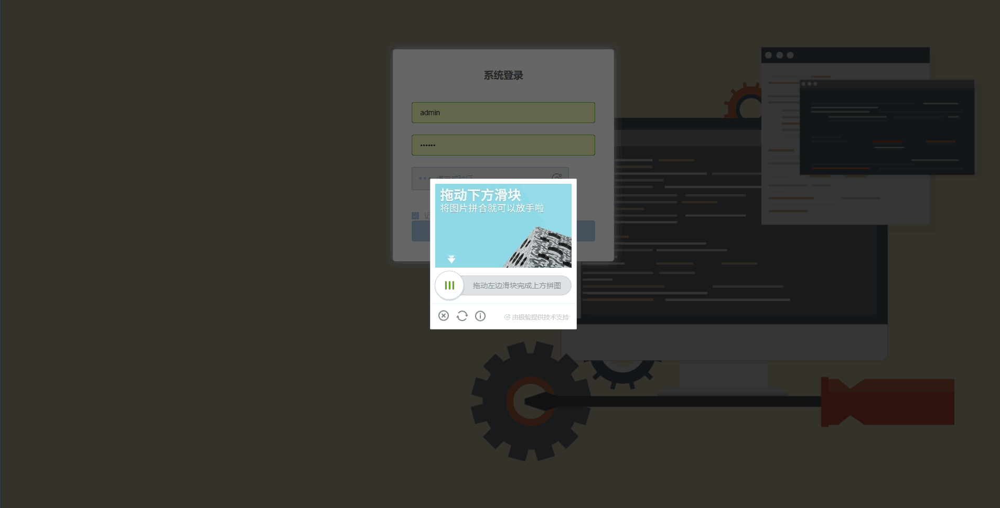
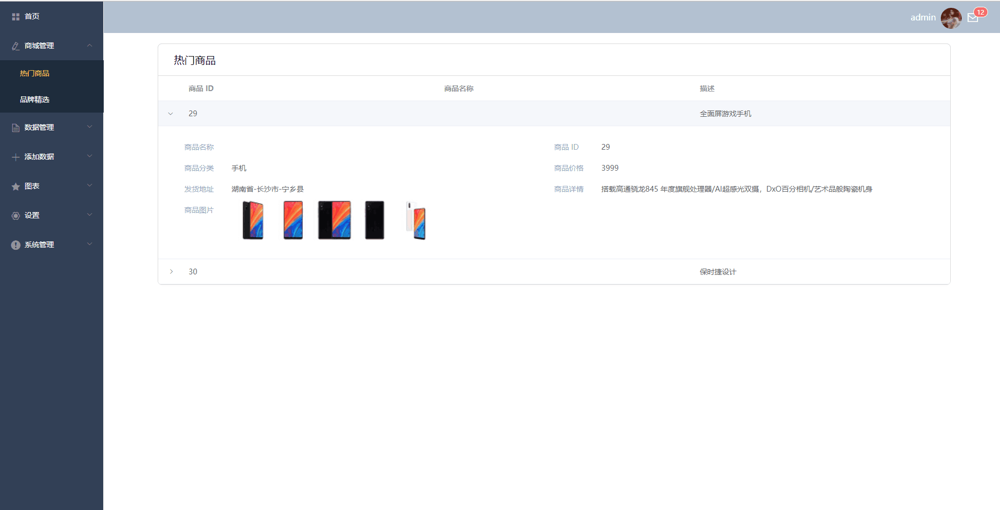
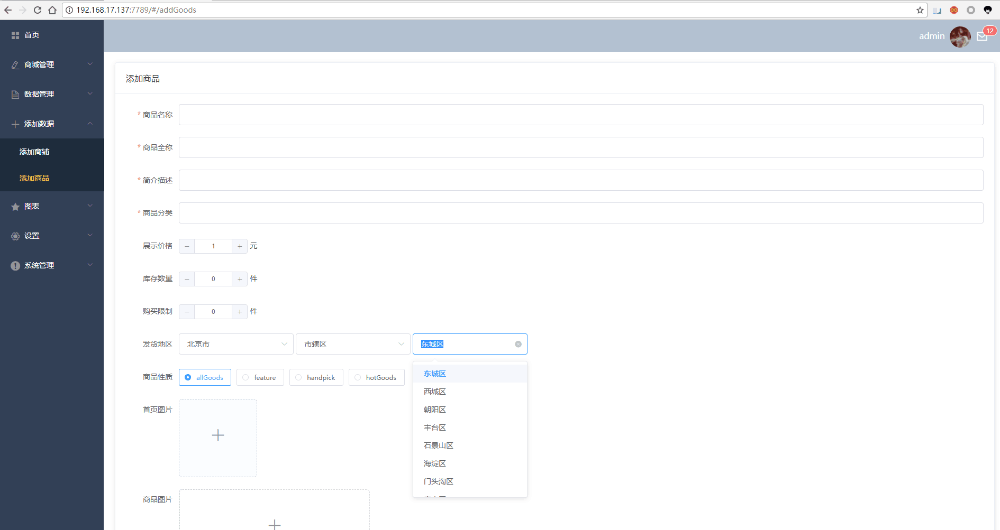
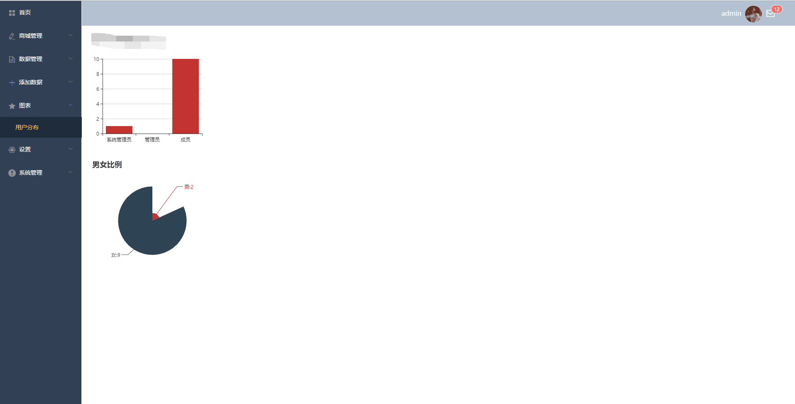

# VE Mall商城

> 一个基于Vue的带后台管理的项目

# 项目正在测试中，在线Demo

- 前台商城：http://47.93.220.254:7789/#/
- 后台管理：http://47.93.220.254:7789/#/login
- 首页没有做处理，图片较多，请耐心等待

前台商城与后台管理登陆账户：

    username：admin
    password：123456

## 项目图片












## 所用技术
- Vue 2.x
- Vuex
- Vue Router
- Element UI
- ES6
- webpack
- axios
- Node.js
- echarts
- 第三方SDK
  - 极验Test-button人机验证码
## Build Setup

``` bash
# install dependencies
npm install

# serve with hot reload at localhost:8080
npm run dev

# build for production with minification
npm run build

# build for production and view the bundle analyzer report
npm run build --report
```

For a detailed explanation on how things work, check out the [guide](http://vuejs-templates.github.io/webpack/) and [docs for vue-loader](http://vuejs.github.io/vue-loader).
  
